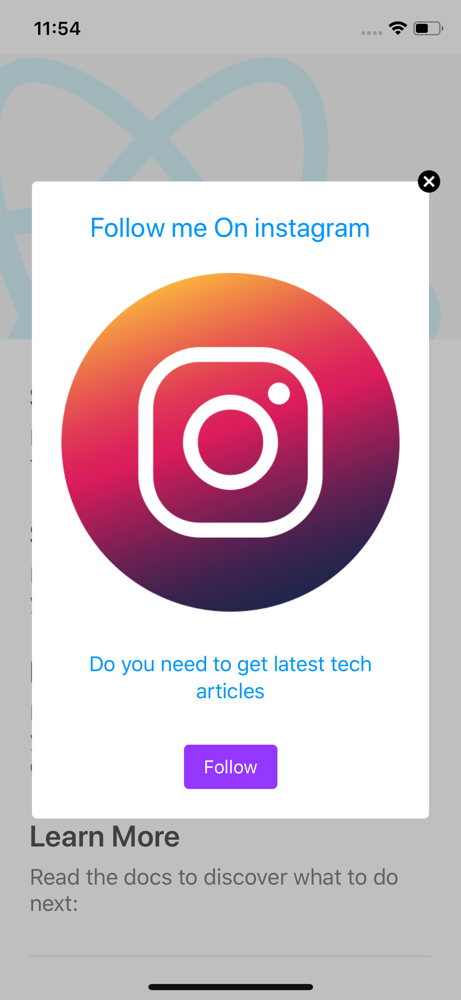

# React Native Firebase InAppMessaging

Replace this file with your GoogleService-Info.plist https://github.com/deshatom/react-native-fireabse-inAppMessaging-ios/blob/master/ios/GoogleService-Info.plist 

This is the firebase doc 
https://firebase.google.com/products/in-app-messaging

# Tutorial on
https://medium.com/@madurajithdeshan/react-native-firebase-in-app-messaging-ios-5e272dee39bb

# Demo screenshot

